# 🐾 PawPalace – Pet Supplies & Services System

PawPalace is a full-stack e-commerce web application that provides a one-stop platform for pet owners to purchase pet supplies and book pet-related services online. The system combines online shopping with service booking, making pet care more convenient, organized, and accessible.

---

## 🌟 Features

### 👤 User Features
- User Registration & Login
- Browse Pet Products
- Search & Filter Products
- Book Pet Services
- Add Products to Cart
- Secure Checkout
- Order Tracking
- User Profile Management

### 🏪 Vendor Features
- Manage Product Inventory
- Manage Pet Services
- View Customer Bookings
- Update Product & Service Details

### 🔑 Admin Features
- User Management
- Vendor Management
- Product Management
- Service Management
- Order Management
- Report Generation

---

## 🎯 Project Objectives

The primary goal of PawPalace is to simplify pet care by providing a centralized digital marketplace where pet owners can:

- Purchase pet supplies online
- Book grooming, veterinary, and training services
- Track their orders
- Make secure online payments
- Enjoy a seamless and user-friendly shopping experience

---

## 🛠️ Tech Stack

### Backend
- Python
- Django
- MySQL

### Frontend
- HTML
- CSS
- Bootstrap 5
- JavaScript

### Tools
- Git
- GitHub
- VS Code

---

## 📌 Functional Requirements

- User Registration & Authentication
- Product Browsing
- Search & Filtering
- Service Booking
- Shopping Cart
- Order Placement
- Order Tracking
- Payment Integration
- Vendor Dashboard
- Admin Panel

---

## 📂 Project Structure

```text
PawPalace/
│
├── accounts/
├── dashboard/
├── orders/
├── payments/
├── images/
├── products/
├── services/
├── core/
├── media/
├── static/
├── templates/
├── manage.py
└── README.md
```

---

## 🚀 Installation

### 1. Clone the Repository

```bash
git clone https://github.com/shreyeeka/PawPalace.git
```

### 2. Navigate to the Project

```bash
cd PawPalace
```

### 3. Create a Virtual Environment

```bash
python -m venv venv
```

### 4. Activate the Virtual Environment

**Windows**

```bash
venv\Scripts\activate
```

**macOS/Linux**

```bash
source venv/bin/activate
```

### 5. Install Dependencies

```bash
pip install -r requirements.txt
```

### 6. Apply Migrations

```bash
python manage.py migrate
```

### 7. Run the Development Server

```bash
python manage.py runserver
```

Open:

```
http://127.0.0.1:8000/
```

---

## Project Screenshots

### Login/Register

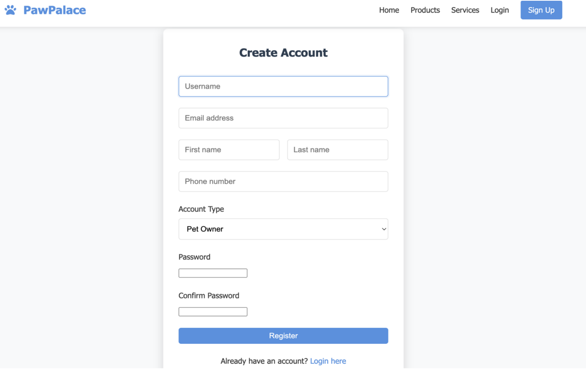
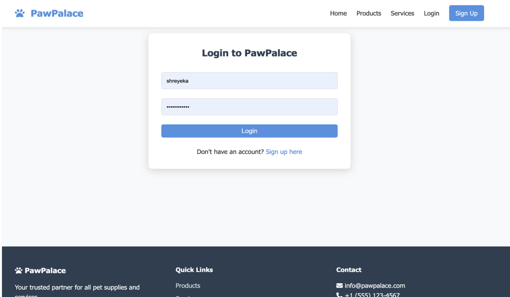

---

### 🏠 Homepage

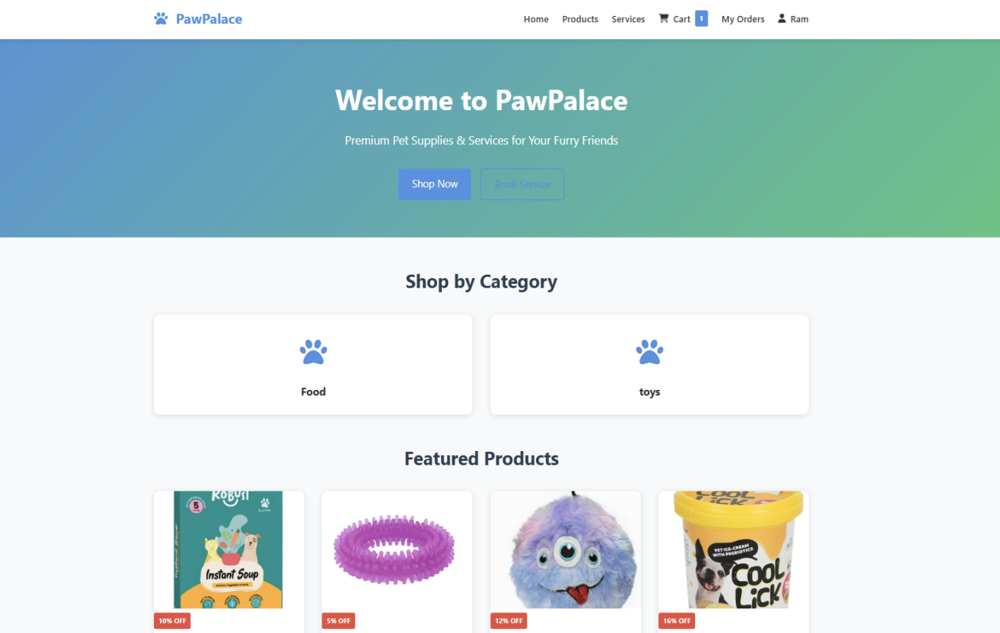

---

### Products Page

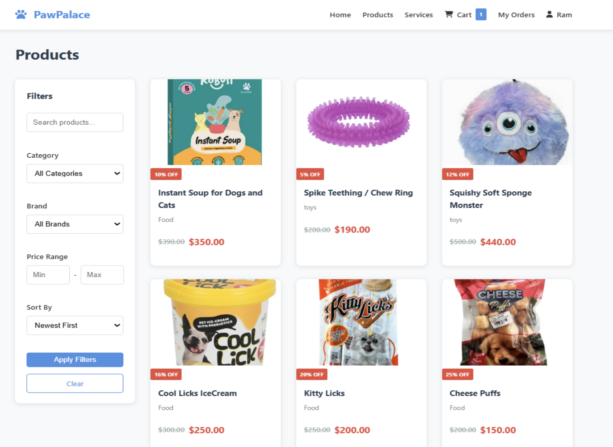

---

### Services Page

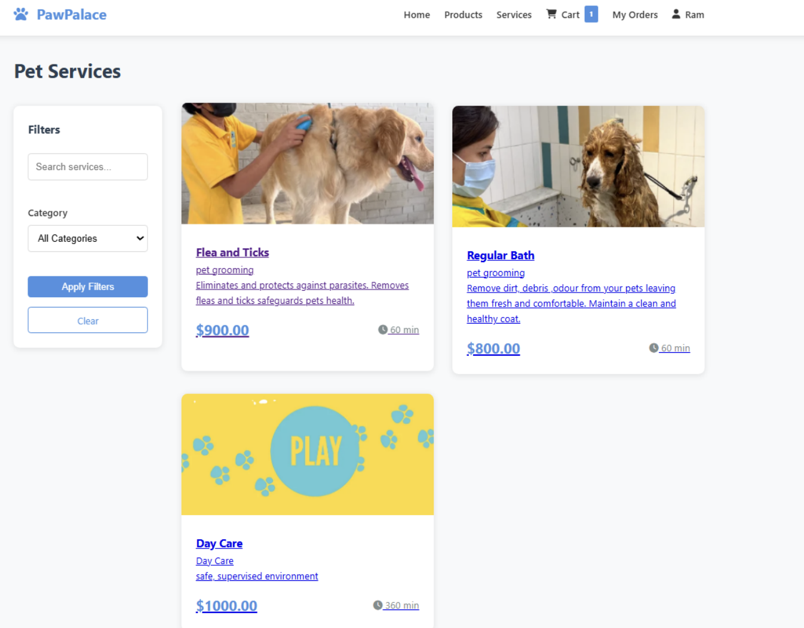

---

### 🛒 Shopping Cart

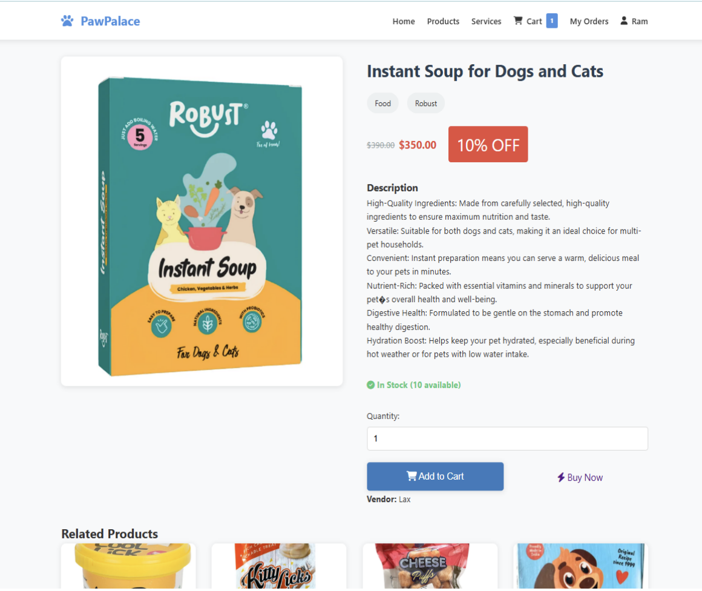
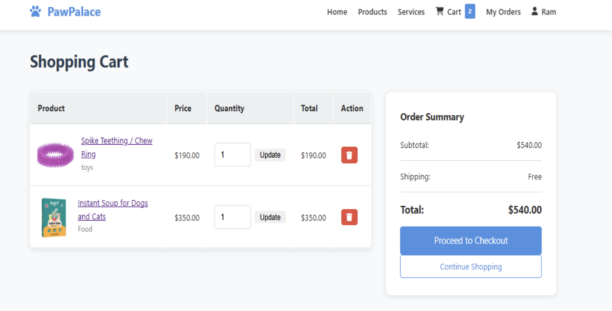

---

### 💳 Checkout

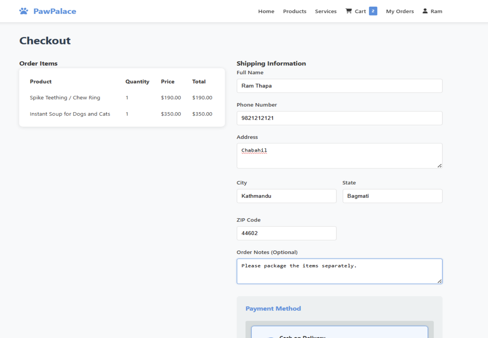
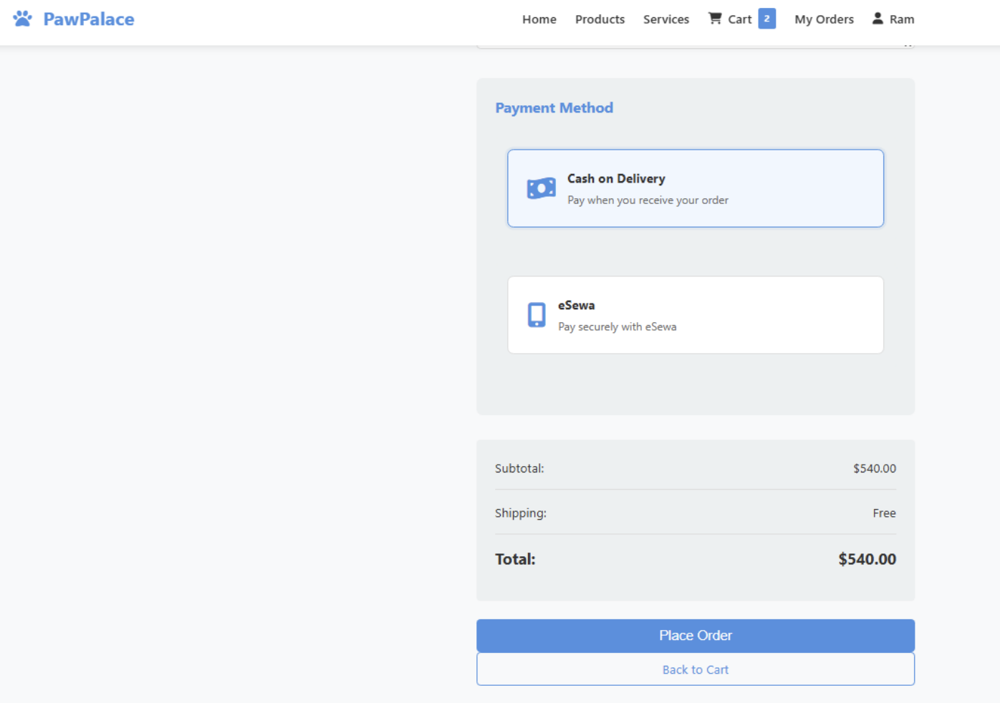

---

### Vendor dashboard

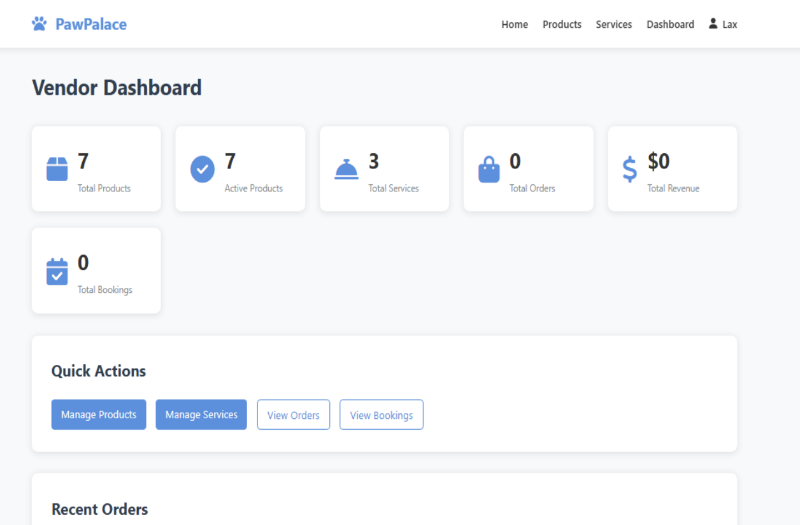

- Vendor add product
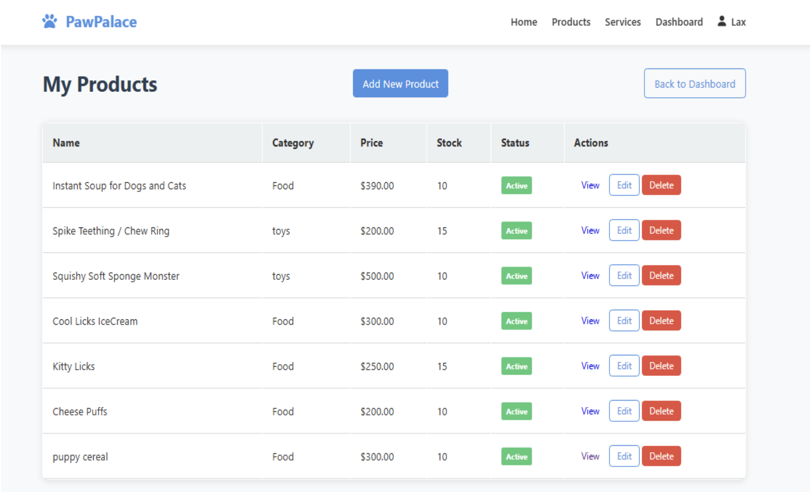
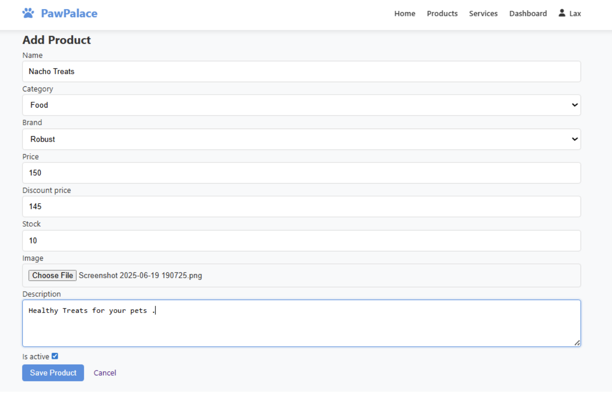

- Vendor add service
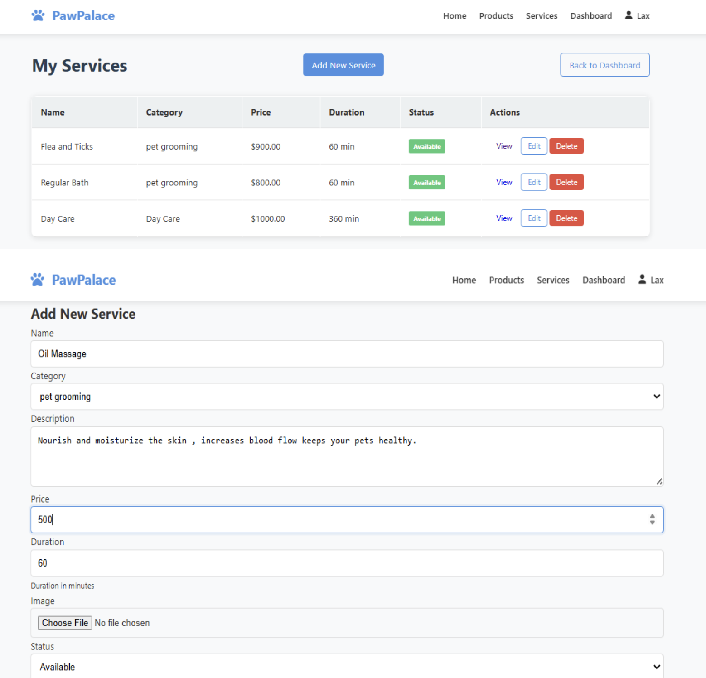

---

### Admin dashboard

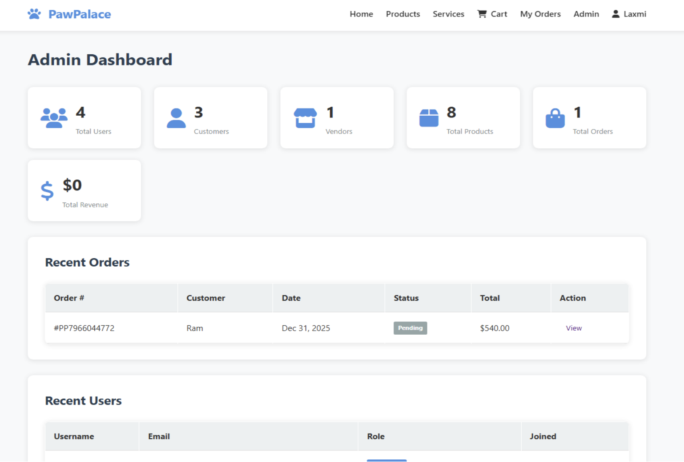
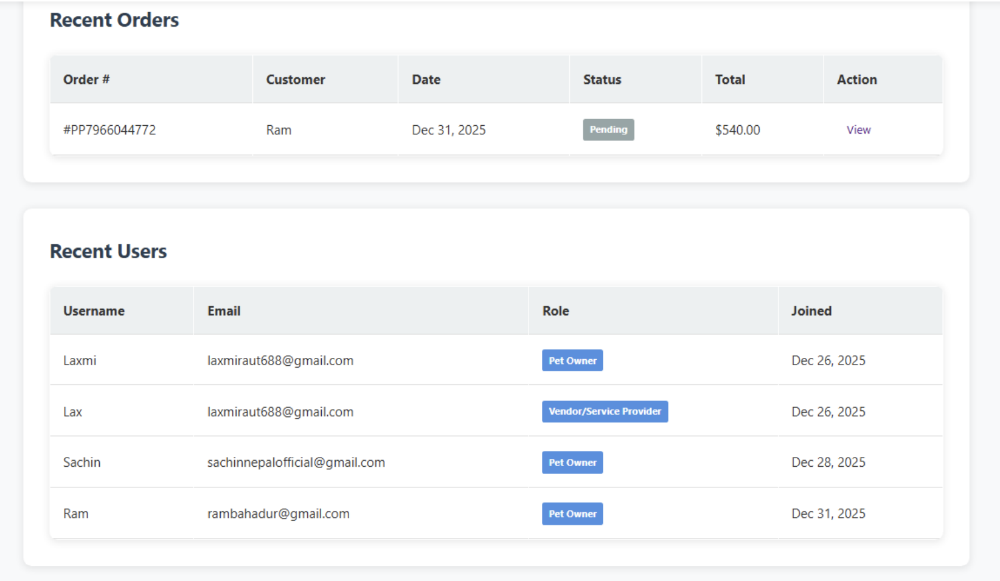

---

## 💡 Key Highlights

- Responsive User Interface
- Secure User Authentication
- Pet Product Shopping
- Pet Service Booking
- Shopping Cart & Checkout
- Order Tracking
- Vendor Dashboard
- Admin Dashboard
- MySQL Database Integration

---

## 🔮 Future Enhancements

- 📱 Mobile Application
- 🩺 Online Veterinary Consultation
- 🎁 Loyalty & Reward System
- 🤖 AI-Based Pet Care Recommendations
- 🚚 Delivery Tracking Integration

---


